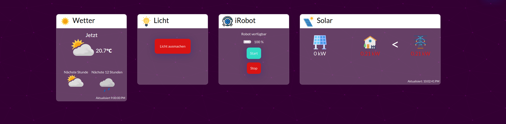

/badge.svg)

# Yah - _Yet Another Homescreen_
 _Yet Another Homescreen_, is a home automation system that simplifies your life by letting you control your smart home appliances right from one screen. 
 launch it on your home tablet / informational screen and you have a functional home smart hub centre. 
 
 The UI builds on the [glassmorphic principle](https://uxdesign.cc/glassmorphism-in-user-interfaces-1f39bb1308c9). 

_Latest Improvement_: Wonderful bugfixes in the hue platform. 
 
## Currently supported systems
- [Philips Hue](https://www.philips-hue.com/)
 
 Control your lights easily with hue integration.

- [YR](https://www.yr.no/)

Get realtime weateher updates from your local area.

- iRobot (together with the [Rest 980 API](https://github.com/koalazak/rest980))

Control your cleaning crew right from a button click.

- [SolarEdge](https://www.solaredge.com/)

Got solar panels? Monitor them right from the same centre. 

## Functionality
- Progressive Web App, supports offline mode
- Runs inside of an Electron wrapper. Packagable for every major os.

### Things to do
- [ ] Package as Ionic App (Android)
- [ ] Automate the electron packaging process in a workflow 

### Future Improvements
- [ ] Make the clock move, to not burn into screen.
- [ ] Make a detailed weather view?
- [x] Make the Screensaver timeout adjustable (currently hardcoded to 5 min)
- [x] Make the user chose the background, currently hardcoded
- [x] Make the weather go by gps cordinations, instead of hardcoding it. 
- [x] Play around with the size of the widgets, i.e the solar panel widget can be bigger, the hue can be smaller

